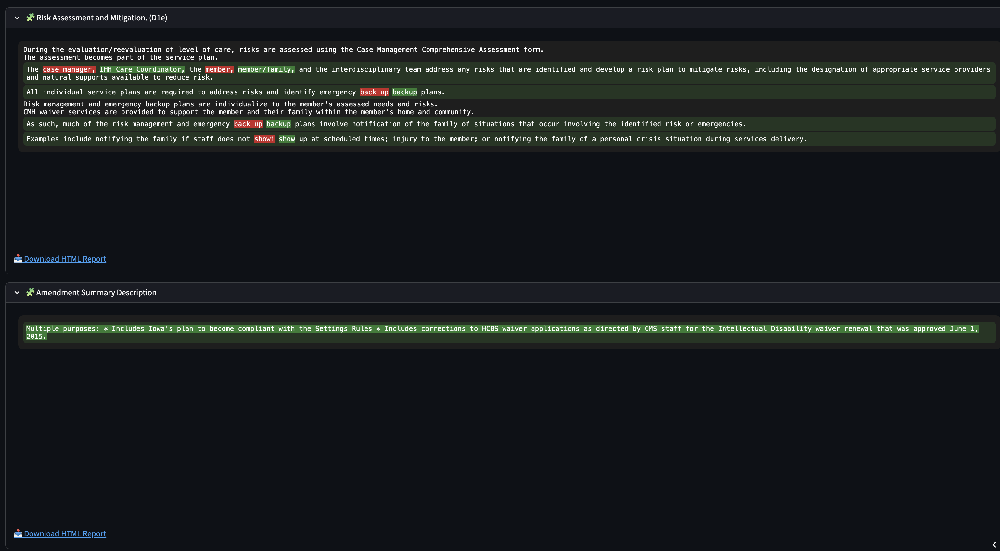
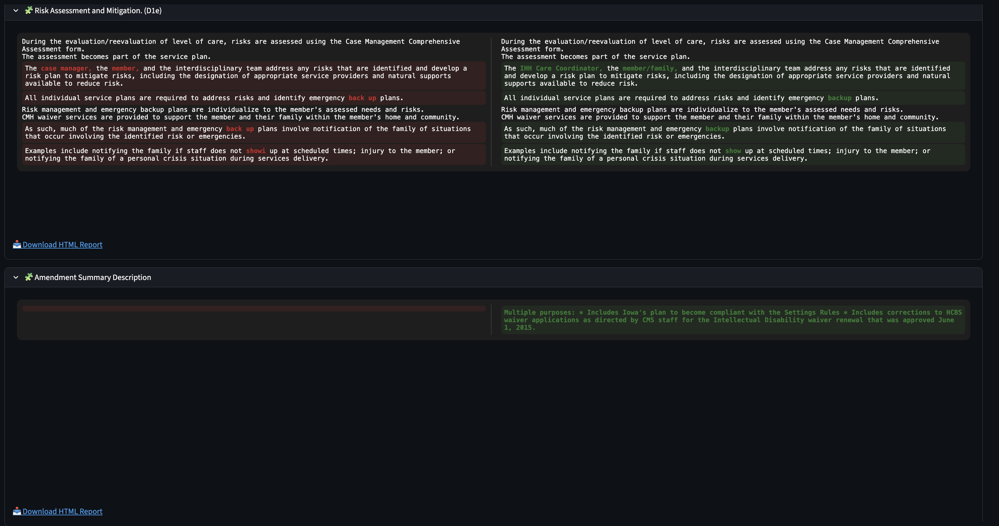

## 📌 Overview

Difference_Check is a Python-based tool deployed on Streamlit designed to compare datasets, detect duplicates, and generate categorized difference reports.

It is especially useful for data analysts, QA teams, auditors, and engineers who frequently compare dataset versions.

---

## 🚀 Features

- Compare two datasets (CSV/XLSX)

- Find Added, Removed, and Modified rows

- Column-level difference detection

- Summary document generation (PDF/Docx)

- Clean CSV/Excel output

- Easily scriptable and lightweight
---

## 🛠 Tech Stack

- Python 3.x

- ```diff_check.py``` (main script)

- Dependencies in ```requirements.txt```

- Uses ```pandas``` for data handling

## 📥 Installation
```
git clone https://github.com/chandan-00/Difference_check.git
cd Difference_check

python3 -m venv venv
source venv/bin/activate        # macOS/Linux
venv\Scripts\activate           # Windows

pip install -r requirements.txt
```
---

## 📄 Input & Output Formats
### Input:

- CSV or Excel files

- One dataset containing the unique documents in each row

- Key columns to match records

- Primary column which contains the id of the document

### Output:

- Difference report for each column (HTML report)

- Categorized changes

- Summary document (HTML report)

---

## 📁 Folder Structure
```
Difference_check/
├── .devcontainer/
├── .gitattributes
├── images
├── diff_check.py
├── requirements.txt
└── README.md
```
---
## 🔍 How It Works

### 🖥️ Streamlit Application

A full Streamlit application is available so users can run the tool without cloning or installing anything.

### 👉 Try the live app:

[Click here to try the app](https://waiverdifferencecheck.streamlit.app/)

### 📂 Step 1 — Upload File

Once the page loads, users can upload their Excel file containing the dataset.
The app auto-detects number of records and text-only columns, as those are the focus for comparison.

### 📑 Step 2 — Select Document IDs

Choose the documents (rows) you want to compare.


### 📌 Step 3 — Select Columns

All text-based columns are auto-selected.
Deselect or select only the ones needed.

Example:
Comparing IA.0819.R01.00 vs IA.0819.R01.01
with columns:

- Risk Assessment and Mitigation (D1e)

- Amendment Summary Description

### 🧩 Inline View Output

Displays text differences inline with highlights.


🧍 Side-by-Side View Output

Displays columns compared side-by-side for easier review.


📥 Download Reports
Download HTML Report

Generates an HTML file showing highlighted differences.


Download Full Report

Generates a summary document containing all selected comparisons.


## 🤝 Contribution

- Fork the repo

- Create a feature branch

- Commit your changes

- Submit a pull request

## 📃 License
This project is licensed under the MIT License - see the [LICENSE.md](./LICENSE) file for details.

## 📬 Support

Open an issue in the GitHub repository for bugs or feature requests.